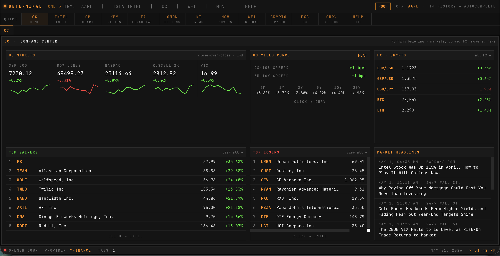

```
████████ ██████   █████  ██████  ███████     ███████ ████████  █████  ████████ ██  ██████  ███    ██ 
   ██    ██   ██ ██   ██ ██   ██ ██          ██         ██    ██   ██    ██    ██ ██    ██ ████   ██ 
   ██    ██████  ███████ ██   ██ █████       ███████    ██    ███████    ██    ██ ██    ██ ██ ██  ██ 
   ██    ██   ██ ██   ██ ██   ██ ██               ██    ██    ██   ██    ██    ██ ██    ██ ██  ██ ██ 
   ██    ██   ██ ██   ██ ██████  ███████     ███████    ██    ██   ██    ██    ██  ██████  ██   ████ 

	A terminal-based trading workspace powered by OpenBB
```

<p align="center">
  
</p>

<div align="center">

[](https://github.com/FlipTheDream/tradeterminal/actions/workflows/docker-publish.yml)


</div>

---

## Overview

Run a full trading terminal workspace inside Docker — no dependency headaches, just `docker compose up`.

---

## Quick Start

> **Choose the right compose file:**
> - **Local access only** → use `docker-compose.pull.yml`
> - **Behind a reverse proxy (FQDN)** → use `docker-compose.yml` (see [Reverse Proxy Setup](#reverse-proxy-setup-fqdn))

### Pull & run locally (no FQDN)

```bash
docker compose -f docker-compose.pull.yml up -d
```

Open [http://localhost:5173](http://localhost:5173) in your browser.

### Pull a specific version

Edit `docker-compose.pull.yml` and change the image tag, e.g.:

```yaml
image: ghcr.io/flipthedream/tradeterminal:v0.0.1
```

### Build & run with your FQDN

```bash
docker compose up -d --build
```

Use this when hosting behind a reverse proxy. Set your domain in `docker-compose.yml` first (see below).

---

## Available Tags

| Tag         | Description                  |
|-------------|------------------------------|
| `latest`    | Most recent tagged release   |
| `v1`        | Latest `v1.x.x` release      |
| `v1.2`      | Latest `v1.2.x` release      |
| `v1.2.3`    | Pinned to a specific version |

Full list available at [GitHub Packages](https://github.com/FlipTheDream/tradeterminal/pkgs/container/tradeterminal).

---

## Ports

| Host Port | Container Port | Purpose      |
|-----------|---------------|--------------|
| `5173`    | `5173`        | Web UI       |

---

## Persistence

The `openbb_platform/` directory on your host is mounted into the container at `/root/.openbb_platform`, preserving OpenBB platform data across container restarts.

---

## Reverse Proxy Setup (FQDN)

The prebuilt image (`docker-compose.pull.yml`) is configured for **localhost only**. Vite's dev server will reject requests from any other hostname.

To host behind a reverse proxy (nginx, Traefik, Caddy, etc.) with your own domain, use `docker-compose.yml` instead.

### 1. Set your FQDN

Edit `docker-compose.yml` and replace `changeme.example.com` with your domain:

```yaml
args:
  FQDN: terminal.mydomain.com
```

### 2. Build and start with the build arg

```bash
docker compose build --no-cache
docker compose up -d
```

This patches Vite's `allowedHosts` at build time so it accepts requests from your domain.

### 3. Example nginx reverse proxy config

```nginx
server {
    listen 443 ssl;
    server_name terminal.mydomain.com;

    location / {
        proxy_pass http://127.0.0.1:5173;
        proxy_http_version 1.1;
        proxy_set_header Upgrade $http_upgrade;
        proxy_set_header Connection "upgrade";
        proxy_set_header Host $host;
        proxy_set_header X-Forwarded-Proto $scheme;
    }
}
```

---

## Requirements

- [Docker](https://docs.docker.com/get-docker/) 20.10+
- [Docker Compose](https://docs.docker.com/compose/install/) v2+
